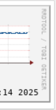

RRDtool (Zero Watermark Edition)
===================================

The OG RRDtool contains a little trick: It will watermark every single graph it generates with a little "logo", i.e, the "RRDTOOL / TOBI OETIKER" text, you saw in the following image.

And this is the default setting!

The same issue was brought up by other people [19 years ago](https://rachaelandtom.info/content/removing-text-rrdtool)([Archive](https://web.archive.org/web/20250815231209/https://rachaelandtom.info/content/removing-text-rrdtool)), yet the narcissistic creator still thinks this is an OK behavior on a tool that is used by millions of users.

Just imagine FFmpeg put its lead devs' names on every video it outputs.

This fork will mainly focus on removing the watermark while keeping compatibility with the OG version. And modernize the build/text pipeline if possible.
